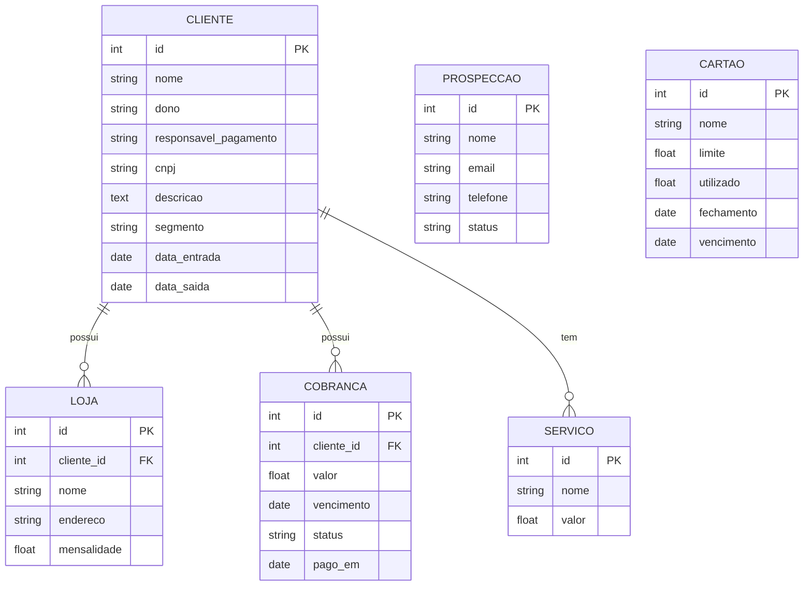
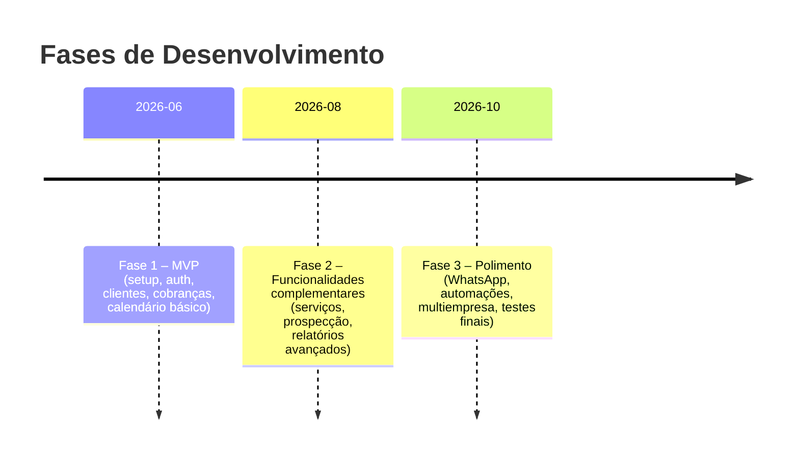

# Resumo Executivo

Este documento consolida e aprimora o _prompt_ geral para o projeto **Vibecode** (SaaS de CRM, cobrança recorrente, financeiro, prospecção e relatórios) e fornece artefatos completos para orientar todo o ciclo de desenvolvimento com IA. Inclui o **prompt geral final** (direto para Claude/GPT), **prompts de skills especializadas**, **README** do projeto, **playbook de desenvolvimento** por etapas (com checklists), **critérios de verificação** (automáticos/manuais) e **prompts de transição** entre modelos. Também são apresentados **exemplos de prompts** para arquitetura, backend, frontend (v0), UI/UX, relatórios, calendário, WhatsApp (módulo futuro), revisão (Continue) e orquestração (Cursor). 

As ferramentas recomendadas são baseadas em fontes oficiais: por exemplo, usar **Supabase** (plataforma Postgres completa) para banco de dados e autenticação【8†L17-L20】, **FullCalendar** para calendário financeiro【10†L22-L24】, **v0.dev** (Vercel) para gerar UIs de alta fidelidade【12†L49-L54】, **Cursor** como IDE assistido por IA【16†L37-L40】, **OpenRouter** para roteamento de múltiplos LLMs【14†L61-L64】 e **Lovable** para prototipagem de apps via chat AI【19†L17-L21】. A pilha sugerida inclui Next.js + Tailwind (front-end) com implantação no Vercel【24†L13-L17】 e Supabase no back-end, garantindo escalabilidade e produtividade.

O fluxo de Vibecode proposto segue etapas claras (arquitetura → backend → API → frontend → UI/UX → dashboards → revisão), sempre trabalhando por módulos e usando o modelo certo para cada tarefa. Além disso, existe uma regra-chave: **sempre perguntar ao usuário antes de passar do backend para frontend/UI** (“Deseja aplicar essa parte agora no frontend/UI ou prefere criar separadamente?”). Isso evita alterações visuais não autorizadas e consumo desnecessário de tokens. Em cada fase há critérios de verificação (ex.: estruturas de dados corretas, lógica de negócio válida, responsividade) que devem ser checados antes de avançar; se falhar, descrevemos ações de correção e prompts específicos para a IA responsável.

A seguir, apresentamos os itens solicitados:

## 1. Prompt Geral Final

O _prompt_ geral reúne os requisitos iniciais e orienta toda a IA sobre o projeto e suas regras. Deve ser fornecido a Claude/GPT-4 (ou outro modelo forte) no início do desenvolvimento. Recomenda-se usar Markdown ou texto claro, listando objetivos, funcionalidades e restrições. Por exemplo:

```plaintext
Você está participando de um projeto Vibecode modular de SaaS de CRM + cobrança recorrente + financeiro + prospecção + relatórios.

**Objetivo do sistema:** criar um sistema web B2B moderno para gestão de clientes e cobranças recorrentes, com as seguintes funcionalidades:

- **Cadastro de Clientes:** nome, CNPJ, dono, responsável pelo pagamento, telefone, e-mail, descrição, TAGs, status (ativo/inativo), data de entrada, data de saída, motivo de saída.
- **Segmentação:** cada cliente pertence a um segmento (e.g. ótica, restaurante, comércio). Segmentos podem ser criados manualmente.
- **Lojas/Unidades:** um cliente pode ter múltiplas lojas (cada loja com nome, endereço, mensalidade própria).
- **Mensalidades e Cobranças:** definir mensalidade de cada cliente (valor, recorrência: mensal, trimestral ou anual). Geração de cobranças recorrentes via **PIX** (cada cliente tem PIX configurado manualmente) ou envio de mensagem com os dados do PIX e valor a pagar.
- **Status de Cobrança:** cada cobrança tem status *PAGO*, *PENDENTE*, *ATRASADO* ou *MUITO_ATRASADO* (mais de 3 meses de atraso). O cálculo de atraso deve ignorar sábados, domingos e feriados cadastrados manualmente (usar fuso de Brasília).
- **Calendário Financeiro:** exibe vencimentos e pendências. Indicação visual: 🟢 pago, 🟡 vence hoje, 🔴 atrasado. Não exibir sábados, domingos nem feriados (configuráveis).
- **Dashboard e Relatórios:** gráficos e tabelas com KPIs financeiros. Exemplos: total pago por segmento, total devedor por segmento, total por cliente, top 10 maiores pagadores, top 10 inadimplentes, clientes em dia vs em atraso, novos vs antigos, churn (clientes que saíram por mês/ano e segmento). Incluir tags de clientes (bom pagador, mal pagador, saiu, etc).
- **Card do Cliente:** exibe resumo (nome, dono, CNPJ, segmento, valor da mensalidade, forma de pagamento, status, TAGs, serviços contratados, se pagou implantação). No *hover* (após ~5s), mostrar mini-resumo financeiro: total pago (azul), total em atraso (vermelho) e mini-gráfico. Ao clicar, exibir histórico completo de cobranças, total pago e total devedor desde a entrada, lista de serviços e lojas vinculadas.
- **Serviços Adicionais:** catálogo de serviços (cada um com valor). Serviços podem ser adicionados ao cliente (aumentando a cobrança mensal) e registrados separadamente. Exemplo inicial: “visita técnica”.
- **Implantação:** marcar se o cliente pagou pela implantação e se isso conta como primeira mensalidade. Se sim, pular a primeira cobrança mensal.
- **Prospecção de Clientes:** módulo de leads. Permite pré-cadastro de possíveis clientes (nome, contato, etc). Status: “permaneceu” (converteu) ou “desistiu”. Botão único para converter lead em cliente.
- **Carteira Financeira:** carteira fictícia para controlar saldo dos recebimentos. Registra entradas (clientes) e saídas (gastos da empresa e pessoais). Permite lançamento manual. Também controlar cartões: nome, limite, usado, data de fechamento e vencimento.
- **Integrações Futuras:** deixar arquitetura preparada para integração com WhatsApp/API (cobrança automática, notificações) como módulo futuro (não implementar agora).
- **Regras gerais:** modularidade, baixa duplicação, consistência entre front/backend, fuso de Brasília, testes de negócio. Se algo não for especificado nos requisitos, responda `"não especificado"`.

**Tecnologias sugeridas (exemplos):** banco de dados no Supabase (Postgres + Auth + APIs automáticas)【8†L17-L20】; frontend em Next.js + Tailwind + shadcn/ui (interface moderna, gráficas responsivas); uso de FullCalendar para o calendário【10†L22-L24】; prototipagem de UI com v0.dev【12†L49-L54】 ou Lovable【19†L17-L21】; roteamento de modelos com OpenRouter【14†L61-L64】; IDE Cursor para código assistido【16†L37-L40】; Continue.dev para revisão automática. 

**Fluxo de desenvolvimento:** trabalho em camadas (arquitetura → backend → APIs → frontend → UI/UX → dashboards → revisão). *Regra obrigatória:* Antes de iniciar qualquer parte de frontend/UI (telas, layout, estilo), SEMPRE pergunte: **“Deseja aplicar essa parte diretamente no frontend/UI agora ou prefere gerar separadamente?”**.

Seu papel como IA é gerar saídas modulares conforme o contexto. Seja conciso, evite repetições e não gaste tokens refazendo o que já foi feito. Forneça listas numeradas ou tabelas curtas sempre que possível. Ao final de cada resposta, liste arquivos criados/alterados e próximos passos.
```

## 2. Habilidades (Skills) e Responsabilidades

Cada IA/modelo será especializada em uma “skill”. A seguir mapeamos as principais skills do projeto, suas responsabilidades e formato de entrada/saída. Use este guia para orientar os prompts a cada módulo.

### **Arquitetura do Sistema (Claude/GPT-4)**
- **Responsabilidades:** definir entidades de banco (Cliente, Cobrança, etc.), relacionamentos, principais atributos, regras de negócio (status, recorrência), design de APIs, padrões de segurança e escalabilidade.  
- **Entradas:** requisitos de alto nível (como listado acima).  
- **Saídas:** modelo de dados (texto ou diagrama), estrutura de pastas/módulos, lista de endpoints/rest e funcionalidades.  
- **Formato da Resposta:** texto estruturado com listas ou blocos curtos (ex.: tabela de entidades, bullets). Sempre cite considerações de escalabilidade. Use trechos como “Sugestão:”, “Entidade Cliente:...”.  
- **Prompt exemplo:** 
  ```
  Você é o arquiteto do sistema. Baseado nos requisitos fornecidos (CRM, cobrança recorrente, calendário, relatórios, carteira, cartões), liste as **entidades principais** (nome e campos) e **relacionamentos** do banco. Defina também as principais **rotas da API** (CRUD de Cliente, Cobrança, etc.) e regras de negócio (ex.: cálculo de status muito atrasado = +90 dias). Não escreva código frontend. Formate em tabelas e listas claras.
  ```

### **Banco de Dados (Claude/Codex)**
- **Responsabilidades:** criar esquema de DB (DDL), configurar chaves e índices, escrever migrations (SQL ou ORM). Definir colunas para cada entidade (tipos, constraints).  
- **Entradas:** definições de entidades e relações da fase de arquitetura.  
- **Saídas:** scripts SQL ou arquivos de modelo ORM (p.ex. Prisma). Deve indicar tipos e restrições (e.g., `NOT NULL`, `UNIQUE`).  
- **Formato da Resposta:** fragmentos de código (SQL ou TypeScript) entre marcadores, acompanhados de breve explicação.  
- **Prompt exemplo:** 
  ```
  Com base nas entidades definidas (por exemplo, CLIENTE, LOJA, COBRANCA), gere o DDL SQL (ou esquema Prisma) para criar essas tabelas no Postgres. Defina chaves primárias, estrangeiras e tipos apropriados. Por exemplo, Cliente(id PK, nome text, cnpj text UNIQUE, ...). 
  ```

### **Backend / API (DeepSeek/Qwen)**
- **Responsabilidades:** implementar lógica de negócio e endpoints REST (ou rotas Next.js API). CRUD de Clientes, Cobranças, Serviços, Autenticação, validações de entrada. Lidar com recorrência, status, cálculos de atraso.  
- **Entradas:** especificações de entidades e endpoints da arquitetura, arquivos de esquema do banco.  
- **Saídas:** código de backend (Node.js/TypeScript ou Supabase Edge Functions). Idealmente funções curtas e modulares. Exemplo: controllers para cada modelo, serviços com regras de cobrança.  
- **Formato da Resposta:** mostrar quais arquivos foram criados/alterados e o código relevante (p.ex. `clientes.ts`, `cobrancas.ts`).  
- **Prompt exemplo:** 
  ```
  Você é o desenvolvedor backend. Implemente o CRUD de **Clientes** em TypeScript usando Next.js API ou Supabase. Isso inclui: rotas para listar, criar, atualizar e deletar clientes, validando CNPJ e status. Use o esquema do banco gerado antes. Indique os arquivos alterados e o código. 
  ```

### **Frontend/Componentes (Qwen/DeepSeek)**
- **Responsabilidades:** criar páginas e componentes React (Next.js) interativos. Tabelas, formulários, botões, cards de cliente, painel de dashboard. Integração com API (fetch/axios). Responder à regra de não exibir dias não úteis no calendário.  
- **Entradas:** design das páginas, rotas e dados da API.  
- **Saídas:** código JSX/TSX de componentes, páginas e estilos (Tailwind classes).  
- **Formato da Resposta:** listar arquivos (.tsx, .css) alterados e mostrar trechos de código.  

- **Prompt exemplo:** 
  ```
  Gere a página de **Lista de Clientes**: um componente React/Next.js com tabela (Nome, CNPJ, Segmento, Mensalidade, Status) e botões de ação (editar, deletar). Use Tailwind para estilo básico. Dados devem ser buscados da API /api/clientes. Não inclua lógica de CSS além de classes utilitárias. Liste o código do componente.
  ```

### **UI/UX (v0/Lovable)**
- **Responsabilidades:** prototipar e refinar a interface visual. Criar layouts modernos, cards interativos e landing pages conforme o estilo SaaS premium. Definir cores e animações sutis.  
- **Entradas:** wireframes conceituais, guias de estilo (cores, fontes).  
- **Saídas:** componentes de alto nível (por exemplo, seção *hero*, cards de KPI, tabelas estilizadas). Código front-end com foco visual (pode usar v0 ou Lovable para gerar o HTML/CSS/JS).  
- **Formato da Resposta:** estrutura de página (divs, componentes), classes de estilo, descrições curtas de design.  
- **Prompt exemplo:** 
  ```
  Você é um designer de UI/UX. Crie a **landing page** do produto: inclua seção hero (headline, subtítulo, CTA), seções de benefícios (com ícones), preview de dashboard (imagem ou gráfico), e FAQ. Estilo: minimalista, profissional. Forneça o HTML/CSS (Tailwind) das seções.
  ```

### **Relatórios e Analytics (Claude/DeepSeek)**
- **Responsabilidades:** elaborar a lógica de cálculo dos relatórios e a interface de dashboard. Gerar consultas agregadas ou funções para totais/percentuais. Criar componentes gráficos (gráficos de barras, linhas, pizza) e tabelas resumo.  
- **Entradas:** base de dados de cobranças, segmentos, tags.  
- **Saídas:** pseudocódigo ou consultas SQL/JS que computem os KPIs; esboço de componentes de gráfico (p.ex. com Recharts).  
- **Formato da Resposta:** listas de métricas e fórmulas, descrição dos gráficos, trechos de query ou React.  
- **Prompt exemplo:** 
  ```
  Gere os relatórios financeiros: escreva consultas (ou funções) para calcular: total pago por segmento, total devedor por cliente, top 10 pagadores, taxas de churn. Em seguida, desenhe o layout do dashboard com gráficos correspondentes (bar chart, linha, gauge). Explique cada cálculo.
  ```

### **Calendário Financeiro (Claude/Front-end)**
- **Responsabilidades:** exibir o calendário mensal com eventos de vencimento. Ignorar sábados, domingos e feriados configurados. Marcar dias pagos/pendentes. Implementar lógica de adição de dias úteis (pular feriados).  
- **Entradas:** datas de vencimento do banco, lista de feriados.  
- **Saídas:** configuração de componente FullCalendar (ou similar) e código que colore os dias (usando os status).  
- **Formato da Resposta:** trechos de código e explicação breve.  
- **Prompt exemplo:** 
  ```
  Implemente o calendário de cobranças usando FullCalendar. Configure para Brasília (UTC-3) e ignore sábados, domingos e feriados (lista fornecida). Marque eventos vencidos (status PAGO/ATRASADO) com bola verde/vermelha. Forneça o código do calendário e função que filtra dias úteis.
  ```

### **Integrações & Automação (Cursor/OpenRouter)**
- **Responsabilidades:** preparar esquemas para futura integração com APIs (ex.: WhatsApp, notificações) e pipelines automatizados de IA. Agentes e regras de automação (ex.: agendar cobrança).  
- **Entradas:** requisitos de integração, credenciais.  
- **Saídas:** planos de ação (fluxos de envio de mensagem), placeholders ou serviços simulados.  
- **Formato da Resposta:** descrições de endpoint/external API.  
- **Prompt exemplo:** 
  ```
  Desenhe a arquitetura para integrar a API do WhatsApp: quando um cliente está em atraso, uma mensagem de cobrança deve ser enviada automaticamente. Escreva um esboço de função (pseudocódigo) ou workflow que faça essa verificação diária e acione a API do WhatsApp. 
  ```

### **Debug e QA (Continue/Claude)**
- **Responsabilidades:** identificar bugs de lógica, problemas de performance, falhas de segurança. Verificar consistência (UI x banco). Corrigir condicionais erradas (ex.: cálculo de atraso).  
- **Entradas:** código-fonte, rastros de erro.  
- **Saídas:** relatórios de bugs e correções sugeridas.  
- **Formato da Resposta:** lista de problemas encontrados e como resolver cada um (pode ser em Markdown).  
- **Prompt exemplo:** 
  ```
  Você é um revisor de código. Analise o trecho de código abaixo (mostrar parte do módulo de cobrança). Aponte possíveis bugs ou casos não tratados (ex.: cálculo de meses de atraso) e sugira correções objetivas.
  ```

### **Revisão de Código (Continue.dev)**
- **Responsabilidades:** executar checagens automáticas em PRs (padrões de nomenclatura, duplicação, tipagem, vulnerabilidades, formatação). Garantir que todas as regras do projeto são seguidas.  
- **Entradas:** diff ou código finalizado.  
- **Saídas:** lista de violações e sugestões (ex.: "O campo X deveria ser camelCase", "Falta validação de e-mail").  
- **Formato da Resposta:** formato de checklist ou relatório com problemas e impactos.  
- **Prompt exemplo:** 
  ```
  Contexto: revisão de código. Objetivo: verificar padrões de nomenclatura (camelCase), tipagem TypeScript e duplicação. Se encontrar erros, liste-os, explique o problema e sugira correção.
  ```  

### **Orquestração de Agentes (Cursor)**
- **Responsabilidades:** integrar as diferentes IAs e manter o contexto do projeto. Criar “missões” para cada agente, passar contexto entre modelos, reagrupar saídas. Aplicar regras do fluxo Vibecode.  
- **Entradas:** resumo do estado atual do projeto, última tarefa concluída.  
- **Saídas:** planos de ação sequenciais, decidindo qual modelo usar a seguir.  
- **Formato da Resposta:** texto organizado (por exemplo: “Passos: 1) revisar arquitetura, 2) gerar CRUD, ...”).  
- **Prompt exemplo:** 
  ```
  Você é o agente orquestrador. Última tarefa: desenhar o modelo de dados. Próxima: implementar backend. Mantenha regras do projeto. Crie um plano em 3 passos: 1) criar endpoints de cliente, 2) criar endpoints de cobrança, 3) testar com Supabase. Liste arquivos a criar.
  ```

## 3. README do Projeto

```markdown
# Projeto Vibecode – CRM Financeiro

**Vibecode** é um SaaS modular para **gestão de clientes, cobranças recorrentes e finanças**. O objetivo é oferecer um painel único com cadastro de clientes, cobrança automática (PIX), controle financeiro (carteira e cartões), prospecção e relatórios inteligentes. A interface será moderna (estilo SaaS premium) com dashboard e interações avançadas.

## Funcionalidades Principais

- **Gestão de Clientes:** cadastro completo (nome, CNPJ, dono, contato, segmento, TAGs, status, etc). Suporta múltiplas lojas por cliente.
- **Cobranças Recorrentes:** mensalidades (ou trimestrais/anuais) com geração de faturas via PIX. Monitoramento de status (pago, pendente, atrasado, muito atrasado).
- **Calendário Financeiro:** visão mensal/diária dos vencimentos, pulando sábados, domingos e feriados configurados. Cores indicam pendências.
- **Relatórios/Dashboard:** métricas financeiras (receita, inadimplência, churn). Gráficos (barras, linhas, pizza) e tabelas top clientes (maiores pagadores, inadimplentes, etc).
- **Serviços Adicionais:** catálogo de serviços avulsos (ex.: visita técnica) que podem ser adicionados ao plano de cada cliente.
- **Prospecção de Clientes:** registro de leads com pré-cadastro e status (converteu ou desistiu).
- **Carteira Financeira:** controle de saldo (entradas de clientes, despesas da empresa/pessoais), incluindo gestão de cartões (saldo, limite, vencimento).
- **Implantação:** informação se o cliente pagou pela implantação e se isso conta como primeira mensalidade.
- **Automação Futuras:** integração com WhatsApp (envio de cobranças/mensagens) planejada como módulo futuro.

## Regras Oficiais

- **Fluxo Vibecode:** desenvolvimento em camadas. Não gerar sistema inteiro de uma vez. Trabalhar por módulos (Arquitetura → Backend → APIs → Frontend → UI/UX → Dashboards → Revisão).
- **Separação Estrita:** backend, frontend e UI/UX são camadas distintas. Não misturar lógica de negócio no código de interface.
- **Modularidade:** cada módulo (clientes, cobranças, dashboard, etc.) em arquivos/pastas próprios. Evitar arquivos gigantes.
- **Pergunta obrigatória:** antes de iniciar qualquer parte de _frontend/UI_ (layout, estilização, animações), sempre pergunte ao usuário: *“Deseja aplicar esta parte agora ou prefere criar separadamente?”*
- **Não assuma indefinidos:** se um requisito não for claro, marcar como “não especificado” e confirmar. 
- **Consistência de dados:** nomes de campos devem bater entre backend e UI. Padrões de nomenclatura (ex.: camelCase em código). 
- **Fuso horário:** usar Horário de Brasília (UTC-3) para cálculos e exibição de datas.
- **Feriados:** lista de feriados deve ser configurável manualmente, usada para pular dias no calendário.
- **Qualidade:** código deve seguir padrões (lint, formatação). Uso de continue.dev para checagem automática de PRs.
- **Tecnologias principais:** Next.js + Tailwind (frontend)【24†L13-L17】, Supabase (Postgres + Auth + APIs)【8†L17-L20】, FullCalendar (calendário interativo)【10†L22-L24】. IA: v0.dev【12†L49-L54】 (UI prototyping), OpenRouter【14†L61-L64】 (API multi-modelos), Cursor【16†L37-L40】 (codificação IA), Continue.dev (revisão).

## Arquitetura Resumida

O sistema será dividido em módulos independentes (cada um com API e UI):

- **Clientes:** cadastro e gerenciamento de clientes e suas lojas.
- **Cobranças:** geração de cobranças, histórico de pagamentos, status financeiro.
- **Financeiro:** painel de carteira e cartões, registro de despesas.
- **Relatórios:** cálculos e visualização de indicadores chave (Receita, Inadimplência, Churn).
- **Prospecção:** leads de possíveis clientes e funil de conversão.
- **Serviços:** catálogo de serviços extras vinculáveis ao cliente.
- **Calendário:** componente visual de vencimentos e status pagos/pendentes.
- **Configurações:** feriados, segmentos, planos, etc.

Cada módulo terá APIs REST (em Next.js ou Supabase Edge Functions) e páginas/ componentes React para UI. A autenticação será feita via Supabase Auth (JWT) ou similar.

**Tecnologias recomendadas:** 
- **Frontend:** Next.js (framework React) + Tailwind CSS + shadcn/ui para UI moderna【24†L13-L17】.
- **Backend/Banco:** Supabase (Postgres com APIs instantâneas, Auth, Storage)【8†L17-L20】. Use o SQL do Supabase ou Prisma.
- **Calendário:** FullCalendar (React)【10†L22-L24】 para exibir vencimentos.
- **Gráficos:** Recharts ou Chart.js para dashboards.
- **UI AI:** v0.dev (Vercel) para gerar protótipos de UI a partir de prompt【12†L49-L54】; Lovable para mockups.
- **IA Multi-modelo:** OpenRouter (rota modelos open/free)【14†L61-L64】 para alternar entre LLMs (Qwen, Claude, etc).
- **IDE AI:** Cursor (assistente de código)【16†L37-L40】.
- **Revisão:** Continue.dev para checagens automáticas em PRs.
- **Hospedagem:** Vercel (front-end & funções serverless).
- **Idiomas:** o sistema e os prompts estão em **Português** (pt-BR); código pode ser em inglês, com comentários em pt.

## Entidades Principais

Exemplo simplificado de entidades e campos (tabela parcial):

| Entidade     | Campos Principais                              | Descrição                                       |
|--------------|-----------------------------------------------|-------------------------------------------------|
| **Cliente**  | id, nome, cnpj, dono, responsavel_pag, status, data_entrada, data_saida, motivo_saida, segmento_id, tags | Informações do cliente final.                 |
| **Segmento** | id, nome                                       | Segmentação de clientes (Ótica, Restaurante, etc.) |
| **Loja**     | id, cliente_id (FK), nome, endereco, mensalidade | Filiais/unidades de um cliente.               |
| **Cobranca** | id, cliente_id (FK), valor, vencimento, status, pago_em | Registro de cada cobrança gerada. Status=Pago/Pendente/Atrasado. |
| **Servico**  | id, nome, valor                                | Catálogo de serviços extras.                  |
| **ClienteServico** | cliente_id (FK), servico_id (FK), data | Tabela de vínculo de serviços por cliente.    |
| **Prospecto**| id, nome, email, telefone, status (permaneceu/desistiu) | Leads em prospecção.                          |
| **Carteira** | id, saldo_atual, ...                           | Saldo consolidado de entrada/saída.           |
| **Cartao**   | id, nome, limite, utilizado, fechamento, vencimento | Informações de cartões de crédito.           |



## Convenções de Código

- **Idiomas:** usar inglês para código (variáveis, tabelas) e Português para prompts e interfaces ao usuário.
- **Estilo:** padronizar em lint/Prettier. Uso de camelCase para variáveis JS/TS e snake_case ou camelCase no banco, com consistência.
- **Organização:** um módulo por pasta (ex.: `modules/clientes`, `modules/cobrancas`, etc), cada um com rotas e componentes próprios.
- **Fuso Horário:** considerar sempre `UTC-3 (Brasília)`. Ex.: `date-fns` ou similar com local.
- **Datas:** armazenar datas em ISO no banco. Calcular horários exibidos no fuso local do usuário.
- **Validações:** CNPJ válido, campos obrigatórios, etc.

# 4. Playbook de Desenvolvimento

O desenvolvimento será dividido em fases (MVP e depois): 



Cada fase possui uma checklist de tarefas. Só avance após **validar cada critério** (veja seção 5).

### Fase 1: MVP (Autenticação e Gestão Básica)
- [ ] Configurar repositório, CI/CD e ambiente de desenvolvimento.
- [ ] Implementar **login**/cadastro de usuário (Auth).
- [ ] Criar CRUD de **Clientes** (API + páginas).
- [ ] Criar CRUD de **Cobranças** recorrentes (API + lógica de status).
- [ ] Exibir **Calendário** básico com dias de cobrança.
- [ ] Dashboard simples: KPIs de receita e inadimplência.
  
**Critérios de Verificação (Fase 1):**
- As APIs (`/api/clientes`, `/api/cobrancas`) retornam dados corretos e validam campos.  
- O calendário exibe apenas dias úteis (sábd/dom/feriados ignorados).  
- Cálculo de atrasos (>90 dias) funciona: após 3 meses sem pagamento, status muda para *MUITO_ATRASADO*.  
- Dashboard apresenta números consistentes (total pago = soma de todas as cobranças pagas, etc).  

**Se algum critério falhar:**
- Revisar código correspondente (e.g., ajuste na query ou no front-end).  
- Prompt de correção (exemplo): *“Detecte por que cobranças com mais de 90 dias não estão marcando ‘muito atrasado’.”* (direcionar ao dev de backend).  
- Verificar regras de negócio (ex.: ignorar feriados). Se o calendário falhar, prompt: *“Corrija a função que calcula os dias úteis para o calendário.”*

### Fase 2: Funcionalidades Complementares
- [ ] Módulo **Serviços**: CRUD de serviços e vínculo a clientes.
- [ ] Módulo **Prospecção**: CRUD de leads e botão de conversão em cliente.
- [ ] **Relatórios Avançados**: implementar tabelas e gráficos (top clientes, receitas por segmento, churn).
- [ ] Tags de cliente: filtrar por bom/mau pagador, antigos/novos, vencidos, etc.
- [ ] Registro de clientes **saídos** e motivos (churn mensal/anual).

**Critérios de Verificação (Fase 2):**
- Relatórios devem refletir fielmente os dados (por exemplo, top 5 maiores pagadores realmente gerados do BD).  
- Links de serviços aparecem no card do cliente e somam à cobrança corretamente.  
- Função de conversão de lead: novo cliente criado com dados corretos e lead marcado como “permaneceu” ou “desistiu”.  

**Se algum critério falhar:**
- Ajustar cálculo/consulta do relatório. Prompt: *“Por que o relatório de receita por segmento está com valor incorreto?”*.  
- No front-end, se tags ou gráficos não aparecem, revisar integração. Prompt: *“Revise o componente de dashboard para garantir que filtra por segmento e status.”*.

### Fase 3: Polimento e Lançamento
- [ ] Preparar **integração com WhatsApp/API** (placeholder).  
- [ ] Configurar notificações (e-mail/WhatsApp) para cobranças em atraso.  
- [ ] Suporte a **multiempresa** (caso aplicável).  
- [ ] Testes automatizados (unitários/integrados).  
- [ ] Documentação final e revisão de segurança.

**Critérios de Verificação (Fase 3):**
- Scripts de automação (notificações) entram em standby sem erros (mesmo que mock).  
- Sistema em produção lida com credenciais sensíveis (nunca commit).  
- Testes cobrem as principais funcionalidades sem falhas.  

**Se algum critério falhar:**
- Adicionar testes ou corrigir bugs encontrados. Prompt: *“Implemente um teste unitário para a função que calcula o saldo da carteira.”*  
- Se a integração de API falhar, revisar credenciais/configuração. Prompt: *“Verifique se as variáveis de ambiente da API do WhatsApp estão corretas.”*.

## 5. Critérios de Verificação e Checklist

Para cada etapa, definimos critérios técnicos/negócio que devem ser validados. Use esta tabela como checklist antes de avançar:

| Critério de Verificação                            | Ação de Revisão / Prompt de Correção                                     |
|----------------------------------------------------|---------------------------------------------------------------------------|
| **APIs respondem corretamente:** Verificar endpoints de clientes/cobranças com dados válidos. | Se falhar, revisar código do endpoint. Prompt: *“Verifique validação e retorno de /api/clientes.”* |
| **Cálculo de status de atraso:** Cobranças com >90 dias devem ser “MUITO_ATRASADO”. | Se errado, revisar lógica de data. Prompt: *“Corrija função que calcula dias de atraso ignorando feriados.”* |
| **Ignorar finais de semana:** Calendário não mostra sábados/domingos. | Se mostrar, ajustar filtro de dia. Prompt: *“Melhore a função que gera eventos do calendário para excluir fins de semana.”* |
| **Dados consistentes no Dashboard:** Soma total pago = somatório de cobranças pagas. | Se incongruente, revisar consulta/agregação. Prompt: *“Detecte discrepância no cálculo de receita total.”* |
| **Migração de lead correta:** Lead marcado corretamente ao converter para cliente. | Se lead não atualizar, corrigir lógica. Prompt: *“Ajuste o fluxo de conversão de lead para cliente.”* |
| **Registro de serviços:** Valor do serviço é somado ao faturamento do cliente. | Se não somar, ajustar código de faturamento. Prompt: *“Verifique associação de serviços às cobranças do cliente.”* |
| **Regras de segmentação:** Filtro por segmento/tags retorna o conjunto correto. | Se errar, corrigir query de filtragem. Prompt: *“Corrija o filtro por segmento no relatório.”* |
| **Autenticação funcionando:** Acesso protegido, rotas restritas exigem login. | Se contornar login, reforçar segurança. Prompt: *“Valide middleware de autenticação para rotas privadas.”* |

Além dos exemplos acima, antes de marcar qualquer item de checklist como concluído, deve-se validar manualmente (ou via testes) cada critério correspondente. Em caso de falha, use prompts direcionados para a IA apropriada (como indicado) para corrigir o problema.

## 6. Prompts de Transição de Contexto

Para manter o contexto entre modelos, use um template de transição ao mudar de IA. Inclua breve histórico e objetivos:

```
**Contexto de Transição:**

- Modelo anterior: [ex.: Claude (arquitetura)]
- Tarefa anterior: [ex.: definiu entidades de banco para Clientes e Cobranças]
- Estado atual: [ex.: temos scripts SQL e endpoints Esqueleto criados]
- Objetivo da próxima IA: [ex.: implementar CRUD de Cliente no backend]
- Restrições: não alterar arquitetura já definida, não assumir requisitos extras.
```

Em seguida, informe a próxima tarefa no prompt da nova IA. Exemplo de prompt de transição:

```
Contexto:
Modelo anterior: Claude
Tarefa anterior: Planejou a arquitetura do banco com entidades Cliente, Loja e Cobrança.
Estado atual: As tabelas foram criadas no Supabase.
Objetivo da próxima IA: Gerar o código do backend para CRUD de Clientes.
Restrições: Use os nomes de campos definidos. Não inventar novas entidades. 
```

Sempre mantenha a clareza sobre o que já foi feito e o que é esperado, evitando refazer trabalho ou quebrar consistência entre módulos.

## 7. Exemplos de Prompts

A seguir, exemplos prontos de prompts para diferentes responsabilidades:

- **Prompt de Arquitetura (Claude/GPT):**  
  ```
  Você é o arquiteto do projeto. Com base nos requisitos (CRM, cobranças, financeiro, prospecção, relatórios), descreva a arquitetura de sistema. Liste as entidades do banco (com principais campos) e seus relacionamentos. Defina também endpoints principais da API (por exemplo, POST /api/clientes, GET /api/cobrancas). Explique as regras de negócio chave (como status de atraso). Seja conciso e use formatação (listas/tabelas).
  ```

- **Prompt de Backend CRUD (DeepSeek/Qwen):**  
  ```
  Tarefa: Desenvolver o **CRUD de Clientes**. Crie rotas para Listar, Criar, Atualizar e Deletar clientes. Use Next.js API (ou Supabase functions). Cada cliente tem nome, CNPJ e segmento. Valide o CNPJ. Retorne JSON com dados do cliente. Liste arquivos (.ts) criados e mostre o código dos handlers.
  ```

- **Prompt de Frontend (v0):**  
  ```
  Crie a interface da **Página de Detalhes do Cliente**. Deve mostrar as informações (nome, CNPJ, segmento, status) e uma lista de cobranças recentes. Incluir um gráfico pequeno de pagamentos (usando cores azul/vermelho). Estilo: moderno, usando componentes card e tabela. Gere o código React/TSX (Next.js) com Tailwind.
  ```

- **Prompt de UI/UX (v0/Lovable):**  
  ```
  Você é um designer de UI. Projete um **card interativo de cliente** para o dashboard. No estado padrão, mostre nome, segmento e status. Ao passar o mouse 5 segundos, exiba detalhes (total pago em azul, total em atraso em vermelho e mini-gráfico). Use um estilo clean e corporativo. Forneça o HTML/CSS (Tailwind) deste card.
  ```

- **Prompt de Relatórios (Claude/GPT):**  
  ```
  Gere a lógica dos relatórios financeiros. Calcule: total pago por segmento, total devedor por cliente, top 5 clientes pagadores, top 5 inadimplentes. Crie também os layouts de dashboard: por exemplo, um gráfico de barras comparando segmentos, um gráfico de pizza de distribuição de status, e tabelas com os top clientes. Explique os cálculos e componentes de visualização usados.
  ```

- **Prompt de Calendário (Claude/Front-end):**  
  ```
  Implemente o **calendário financeiro**. Use FullCalendar ou similar. Configurar região Brasília e datas customizadas de feriados (por exemplo: 2026-09-07, 2026-11-02). Não mostrar sábados/domingos. Marcar dias com cobrança pendente em vermelho e pagos em verde. Forneça o código de inicialização do calendário e da função que colore os dias.
  ```

- **Prompt de Integração WhatsApp (Claude):**  
  ```
  Escreva um esboço de função (pseudocódigo) para enviar cobranças via WhatsApp. Quando um cliente ficar em atraso, o sistema deve enviar uma mensagem com o PIX e valor. Use linguagem descritiva para o fluxo (ex.: consulta atrasados, formata mensagem, chama API). Não é necessário o código exato da API, mas mostre como seria integrado.
  ```

- **Prompt de Revisão (Continue.dev):**  
  ```
  Contexto: revisão de código do módulo de cobrança. Verifique padrões de nomenclatura (camelCase), validação de campos (e.g. CNPJ), e consistência entre front-end e back-end. Aponte duplicações de lógica ou funções muito longas. Cada problema deve ter impacto e sugestão de correção. Não reescreva tudo, apenas pontue.
  ```

- **Prompt de Orquestração (Cursor):**  
  ```
  Você é o agente coordenador. Última ação: criação da API de clientes. Próxima: criação da API de cobranças. Plano:
  1) Implementar rotas CRUD de cobranças (GET/POST/PUT/DELETE). 
  2) Testar manualmente com exemplos de dados. 
  3) Atualizar documentação do endpoint. 
  Liste os arquivos que serão afetados e qualquer dependência de contexto.
  ```

Cada exemplo acima está pronto para uso (copiar/colar) no chat com o modelo correspondente. Ajuste apenas os detalhes (por exemplo, nomes de arquivos) conforme o avanço do projeto.

**Fontes:** as recomendações de ferramentas são baseadas nas respectivas documentações oficiais: Supabase【8†L17-L20】, Next.js+Vercel【24†L13-L17】, FullCalendar【10†L22-L24】, v0.dev【12†L49-L54】, OpenRouter【14†L61-L64】, Cursor【16†L37-L40】, Lovable【19†L17-L21】. Essas referências atestam a adequação da pilha tecnológica sugerida.